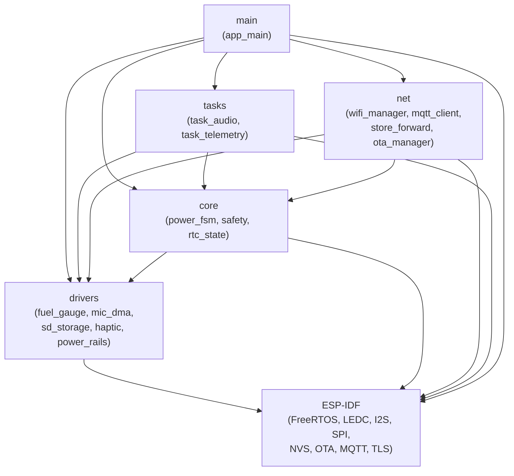
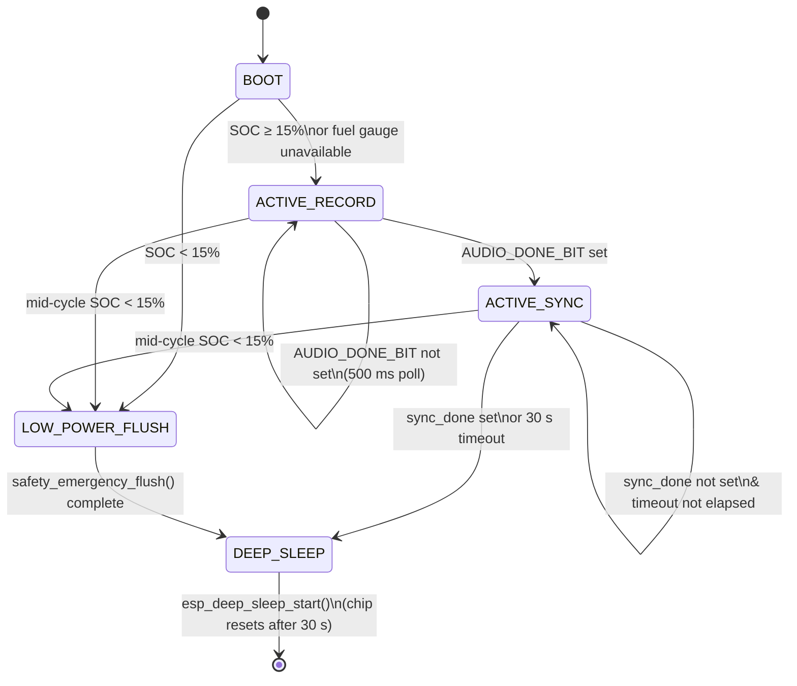
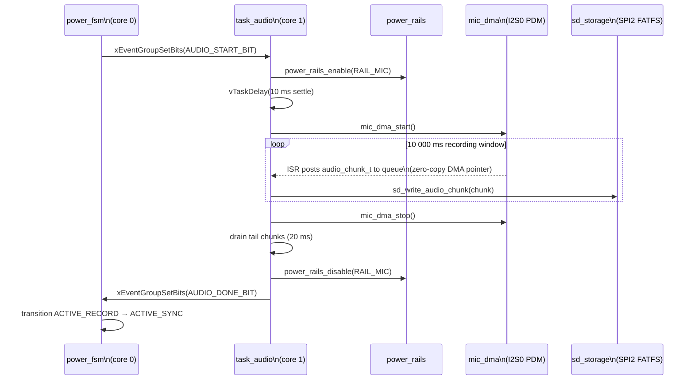
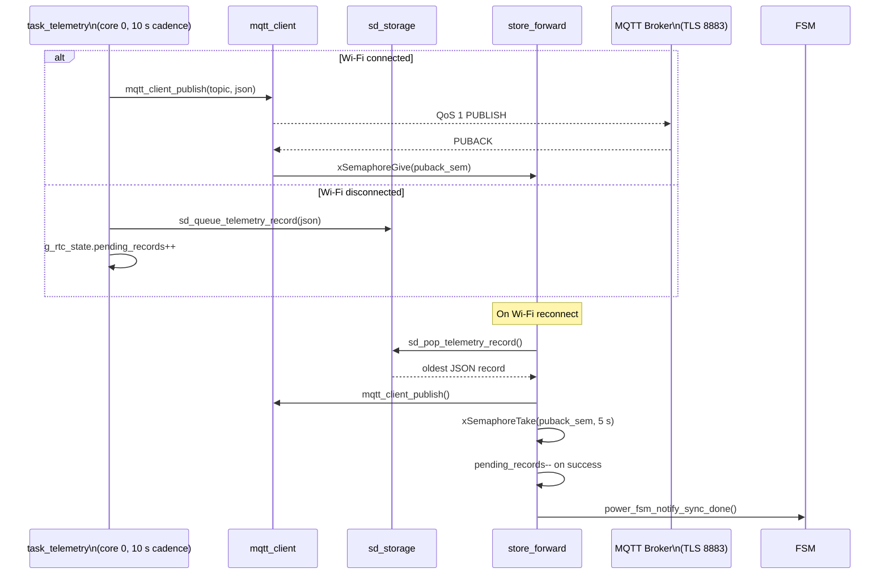

# SHA-Node Firmware Architecture

ESP32-S3 dual-core (Xtensa LX7), ESP-IDF v5.x, FreeRTOS, C99.

---

## Component Dependency Graph

Arrows point from dependant to dependency.  No circular dependencies exist.

---

## Power State Machine

Entry to `DEEP_SLEEP` always runs:
1. `safety_emergency_flush()` — haptic off → HAPTIC+MODEM rails cut → SD queue flushed
2. `power_rails_all_off()` — all four rails driven LOW
3. `rtc_state_save()` — boot count + pending records persisted to RTC slow memory
4. `esp_deep_sleep_start()` — timer wakeup after `DEEP_SLEEP_DURATION_US` (30 s)

---

## Audio Recording Pipeline

---

## Telemetry Data Path

---

## Key Hardware Assignments

| Peripheral | GPIOs | ESP-IDF Driver |
|---|---|---|
| MAX17048 fuel gauge | SDA=8, SCL=9 | I2C master (new v5 API) |
| PDM microphone | DATA=4, CLK=5 | I2S0 RX, ping-pong DMA |
| SD card | MOSI=11, MISO=13, CLK=12, CS=10 | SPI2 + FATFS |
| Haptic motor | GPIO 6 | LEDC ch0, 10-bit duty, `esp_timer` sequencing |
| Power rail MIC | GPIO 15 | GPIO output, active-HIGH |
| Power rail SD | GPIO 16 | GPIO output, active-HIGH |
| Power rail HAPTIC | GPIO 17 | GPIO output, active-HIGH |
| Power rail MODEM | GPIO 18 | GPIO output, active-HIGH |
| USB VBUS sense | GPIO 21 | GPIO input, read in safety checks |

---

## FreeRTOS Task Map

| Task | Core | Priority | Stack | Created by |
|---|---|---|---|---|
| `task_audio` | 1 | 5 | 8 192 B | `task_audio_start()` |
| `mqtt_pub` | 0 | 4 | 6 144 B | `mqtt_client_init()` |
| `store_fwd` | 0 | 4 | 4 096 B | `store_forward_on_reconnect()` (one-shot) |
| `task_telemetry` | 0 | 3 | 4 096 B | `task_telemetry_start()` |
| `fuel_gauge_bg` | any | 2 | 2 048 B | `fuel_gauge_init()` |

`power_fsm_run()` executes in the `app_main` task (core 0, priority 1) and never returns.

---

## Safety Interlocks Summary

| Gate | Condition | Fallback |
|---|---|---|
| OTA start | SOC ≥ 30 % **or** USB VBUS HIGH | Return `ESP_ERR_INVALID_STATE` |
| Haptic pulse | SOC ≥ 15 % | Return `ESP_ERR_NOT_ALLOWED` |
| Mid-cycle low battery | SOC < 15 % (any state except BOOT/FLUSH/SLEEP) | Force `LOW_POWER_FLUSH` |
| Emergency flush | Always — SOC irrelevant | Runs haptic→rails→SD in order; returns first error |

Fuel-gauge read failure in safety checks defaults SOC to 0 (most conservative path).
